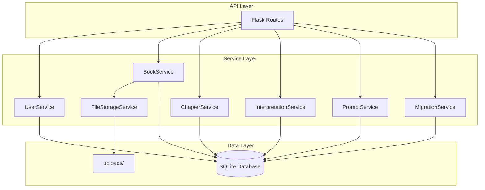

# Design Document: Database Architecture Restructure

## Overview

本设计文档描述 PDF 解读系统数据库架构重构的技术实现方案。重构将现有的 4 表结构扩展为 9 表结构，支持用户管理、书籍状态追踪、PDF 文件存储、章节内容分离、重构映射、解读关联和提示词版本管理。

### 设计目标

1. **向后兼容**: 保留现有 API 接口，新增字段使用默认值
2. **数据完整性**: 使用外键约束和级联删除保证数据一致性
3. **查询性能**: 通过分表优化大文本字段的查询效率
4. **可追溯性**: 完整记录书籍处理流程和解读生成历史

### 技术栈

- **后端框架**: Flask 3.0.3 + Flask-CORS
- **ORM**: SQLAlchemy 2.0.35
- **数据库**: SQLite
- **文件存储**: 本地文件系统 (uploads/ 目录)

## Architecture



### 数据库表关系

```mermaid
erDiagram
    users ||--o{ interpretations : "creates"
    books ||--o{ chapters : "contains"
    books ||--o{ interpretations : "has"
    books ||--o{ chapter_mappings : "source"
    books ||--o{ chapter_mappings : "target"
    chapters ||--|| chapter_contents : "has"
    chapters ||--o{ interpretations : "has"
    chapters ||--o{ chapter_mappings : "mapped"
    interpretations ||--|| interpretation_contents : "has"
    
    users {
        int id PK
        string username UK
        string email UK
        string password_hash
        string profession
        string reading_goal
        string focus_areas
        datetime created_at
        datetime updated_at
    }
    
    books {
        int id PK
        string filename
        string source_type
        int parent_book_id FK
        string language
        string status
        int chapter_count
        int total_word_count
        string file_path
        string file_hash UK
        datetime created_at
    }
    
    chapters {
        int id PK
        int book_id FK
        int chapter_index
        string title
        string title_zh
        string summary
        int word_count
        bool is_translated
        datetime created_at
        datetime translated_at
    }
    
    chapter_contents {
        int id PK
        int chapter_id FK UK
        text content
        text content_zh
    }
    
    chapter_mappings {
        int id PK
        int new_book_id FK
        int new_chapter_id FK
        int source_book_id FK
        string source_chapter_ids
        datetime created_at
    }
    
    interpretations {
        int id PK
        int book_id FK
        int chapter_id FK
        int user_id FK
        string interpretation_type
        string prompt_version
        text prompt_text
        text thinking_process
        int word_count
        string model_used
        datetime created_at
    }
    
    interpretation_contents {
        int id PK
        int interpretation_id FK UK
        text content
    }
    
    prompts {
        int id PK
        string name
        string type
        string version
        text content
        bool is_active
        datetime created_at
    }
    
    settings {
        string key PK
        string value
        datetime updated_at
    }
```

## Components and Interfaces

### 1. UserService

负责用户注册、认证和配置文件管理。

```python
class UserService:
    def create_user(self, username: str, password: str, email: Optional[str] = None) -> int:
        """创建新用户，返回 user_id"""
        pass
    
    def authenticate(self, username: str, password: str) -> Optional[Dict]:
        """验证用户凭据，返回用户信息或 None"""
        pass
    
    def update_profile(self, user_id: int, profession: str, reading_goal: str, focus_areas: List[str]) -> bool:
        """更新用户配置文件"""
        pass
    
    def get_user(self, user_id: int) -> Optional[Dict]:
        """获取用户信息"""
        pass
    
    def delete_user(self, user_id: int) -> bool:
        """删除用户（解读中的 user_id 设为 NULL）"""
        pass
```

### 2. BookService

负责书籍的创建、状态管理和查询。

```python
class BookService:
    def create_book(self, filename: str, source_type: str = 'upload', 
                    parent_book_id: Optional[int] = None, language: str = 'zh') -> int:
        """创建书籍记录，返回 book_id"""
        pass
    
    def update_status(self, book_id: int, status: str) -> bool:
        """更新书籍状态: 'parsing' | 'translating' | 'ready'"""
        pass
    
    def get_book(self, book_id: int) -> Optional[Dict]:
        """获取书籍详情"""
        pass
    
    def list_books(self, status: Optional[str] = None) -> List[Dict]:
        """列出书籍，可按状态筛选"""
        pass
    
    def delete_book(self, book_id: int) -> bool:
        """删除书籍（级联删除章节和解读）"""
        pass
    
    def find_by_hash(self, file_hash: str) -> Optional[int]:
        """通过文件哈希查找书籍，返回 book_id 或 None"""
        pass
```

### 3. FileStorageService

负责 PDF 文件的存储和去重。

```python
class FileStorageService:
    UPLOAD_DIR = "uploads"
    
    def save_file(self, file_data: bytes, filename: str) -> Tuple[str, str]:
        """保存文件，返回 (file_path, file_hash)"""
        pass
    
    def calculate_hash(self, file_data: bytes) -> str:
        """计算文件 MD5 哈希"""
        pass
    
    def delete_file(self, file_path: str) -> bool:
        """删除文件"""
        pass
    
    def file_exists(self, file_hash: str) -> bool:
        """检查文件是否已存在"""
        pass
```

### 4. ChapterService

负责章节的创建、翻译状态管理和内容存储。

```python
class ChapterService:
    def create_chapter(self, book_id: int, chapter_index: int, title: str, 
                       content: str, word_count: int) -> int:
        """创建章节及其内容，返回 chapter_id"""
        pass
    
    def update_translation(self, chapter_id: int, title_zh: str, 
                           content_zh: str, summary: str) -> bool:
        """更新章节翻译内容"""
        pass
    
    def get_chapter(self, chapter_id: int, include_content: bool = False) -> Optional[Dict]:
        """获取章节信息，可选包含内容"""
        pass
    
    def list_chapters(self, book_id: int) -> List[Dict]:
        """列出书籍的所有章节（不含内容）"""
        pass
    
    def delete_chapter(self, chapter_id: int) -> bool:
        """删除章节（级联删除内容）"""
        pass
    
    def create_mapping(self, new_book_id: int, new_chapter_id: int, 
                       source_book_id: int, source_chapter_ids: List[int]) -> int:
        """创建重构映射"""
        pass
```

### 5. InterpretationService

负责解读的创建、查询和关联管理。

```python
class InterpretationService:
    def create_interpretation(self, book_id: int, content: str,
                              chapter_id: Optional[int] = None,
                              user_id: Optional[int] = None,
                              interpretation_type: str = 'standard',
                              prompt_version: Optional[str] = None,
                              prompt_text: Optional[str] = None,
                              thinking_process: Optional[str] = None,
                              model_used: Optional[str] = None) -> int:
        """创建解读及其内容，返回 interpretation_id"""
        pass
    
    def get_interpretation(self, interpretation_id: int, include_content: bool = True) -> Optional[Dict]:
        """获取解读信息"""
        pass
    
    def list_interpretations(self, book_id: Optional[int] = None,
                             chapter_id: Optional[int] = None,
                             user_id: Optional[int] = None,
                             interpretation_type: Optional[str] = None) -> List[Dict]:
        """列出解读，支持多条件筛选"""
        pass
    
    def delete_interpretation(self, interpretation_id: int) -> bool:
        """删除解读（级联删除内容）"""
        pass
```

### 6. PromptService

负责提示词的版本管理。

```python
class PromptService:
    def create_prompt(self, name: str, prompt_type: str, version: str, 
                      content: str, is_active: bool = False) -> int:
        """创建提示词版本，返回 prompt_id"""
        pass
    
    def get_active_prompt(self, prompt_type: str) -> Optional[Dict]:
        """获取指定类型的激活提示词"""
        pass
    
    def set_active(self, prompt_id: int) -> bool:
        """设置提示词为激活状态（同类型其他版本设为非激活）"""
        pass
    
    def list_prompts(self, prompt_type: Optional[str] = None) -> List[Dict]:
        """列出提示词，可按类型筛选"""
        pass
```

### 7. MigrationService

负责数据迁移。

```python
class MigrationService:
    def run_migration(self) -> Dict[str, Any]:
        """执行数据迁移，返回迁移结果统计"""
        pass
    
    def migrate_books(self) -> int:
        """迁移书籍数据，返回迁移数量"""
        pass
    
    def migrate_chapters(self) -> int:
        """迁移章节数据（拆分到 chapters 和 chapter_contents），返回迁移数量"""
        pass
    
    def migrate_interpretations(self) -> Tuple[int, List[int]]:
        """迁移解读数据，返回 (成功数量, 未匹配的解读ID列表)"""
        pass
    
    def create_upload_directory(self) -> bool:
        """创建 uploads 目录"""
        pass
```

## Data Models

### 1. users 表

| 字段 | 类型 | 约束 | 说明 |
|------|------|------|------|
| id | INTEGER | PRIMARY KEY AUTOINCREMENT | 用户ID |
| username | TEXT | NOT NULL UNIQUE | 用户名 |
| email | TEXT | UNIQUE | 邮箱（可选） |
| password_hash | TEXT | NOT NULL | 密码哈希 |
| profession | TEXT | | 职业 |
| reading_goal | TEXT | | 阅读目标 |
| focus_areas | TEXT | | 关注领域（JSON数组） |
| created_at | TEXT | NOT NULL | 创建时间 |
| updated_at | TEXT | | 更新时间 |

### 2. books 表

| 字段 | 类型 | 约束 | 说明 |
|------|------|------|------|
| id | INTEGER | PRIMARY KEY AUTOINCREMENT | 书籍ID |
| filename | TEXT | NOT NULL | 文件名 |
| source_type | TEXT | NOT NULL DEFAULT 'upload' | 来源类型 |
| parent_book_id | INTEGER | FOREIGN KEY | 重构来源书籍ID |
| language | TEXT | DEFAULT 'zh' | 语言 |
| status | TEXT | DEFAULT 'parsing' | 处理状态 |
| chapter_count | INTEGER | NOT NULL DEFAULT 0 | 章节数 |
| total_word_count | INTEGER | NOT NULL DEFAULT 0 | 总字数 |
| file_path | TEXT | | PDF文件路径 |
| file_hash | TEXT | | 文件MD5哈希 |
| created_at | TEXT | NOT NULL | 创建时间 |

### 3. chapters 表

| 字段 | 类型 | 约束 | 说明 |
|------|------|------|------|
| id | INTEGER | PRIMARY KEY AUTOINCREMENT | 章节ID |
| book_id | INTEGER | NOT NULL FOREIGN KEY | 所属书籍ID |
| chapter_index | INTEGER | NOT NULL | 章节序号 |
| title | TEXT | NOT NULL | 原文标题 |
| title_zh | TEXT | | 中文标题 |
| summary | TEXT | | 章节概要 |
| word_count | INTEGER | NOT NULL DEFAULT 0 | 字数 |
| is_translated | INTEGER | DEFAULT 0 | 翻译状态 |
| created_at | TEXT | NOT NULL | 创建时间 |
| translated_at | TEXT | | 翻译完成时间 |

### 4. chapter_contents 表

| 字段 | 类型 | 约束 | 说明 |
|------|------|------|------|
| id | INTEGER | PRIMARY KEY AUTOINCREMENT | 内容ID |
| chapter_id | INTEGER | NOT NULL UNIQUE FOREIGN KEY | 章节ID |
| content | TEXT | | 原文内容 |
| content_zh | TEXT | | 中文翻译内容 |

### 5. chapter_mappings 表

| 字段 | 类型 | 约束 | 说明 |
|------|------|------|------|
| id | INTEGER | PRIMARY KEY AUTOINCREMENT | 映射ID |
| new_book_id | INTEGER | NOT NULL FOREIGN KEY | 新书籍ID |
| new_chapter_id | INTEGER | NOT NULL FOREIGN KEY | 新章节ID |
| source_book_id | INTEGER | FOREIGN KEY | 源书籍ID |
| source_chapter_ids | TEXT | NOT NULL | 源章节ID列表（JSON） |
| created_at | TEXT | NOT NULL | 创建时间 |

### 6. interpretations 表

| 字段 | 类型 | 约束 | 说明 |
|------|------|------|------|
| id | INTEGER | PRIMARY KEY AUTOINCREMENT | 解读ID |
| book_id | INTEGER | NOT NULL FOREIGN KEY | 书籍ID |
| chapter_id | INTEGER | FOREIGN KEY | 章节ID（可选） |
| user_id | INTEGER | FOREIGN KEY | 用户ID（可选） |
| interpretation_type | TEXT | NOT NULL DEFAULT 'standard' | 解读类型 |
| prompt_version | TEXT | | 提示词版本 |
| prompt_text | TEXT | | 提示词快照 |
| thinking_process | TEXT | | 思考过程 |
| word_count | INTEGER | DEFAULT 0 | 字数 |
| model_used | TEXT | | 使用的模型 |
| created_at | TEXT | NOT NULL | 创建时间 |

### 7. interpretation_contents 表

| 字段 | 类型 | 约束 | 说明 |
|------|------|------|------|
| id | INTEGER | PRIMARY KEY AUTOINCREMENT | 内容ID |
| interpretation_id | INTEGER | NOT NULL UNIQUE FOREIGN KEY | 解读ID |
| content | TEXT | NOT NULL | 解读内容 |

### 8. prompts 表

| 字段 | 类型 | 约束 | 说明 |
|------|------|------|------|
| id | INTEGER | PRIMARY KEY AUTOINCREMENT | 提示词ID |
| name | TEXT | NOT NULL | 提示词名称 |
| type | TEXT | NOT NULL | 类型 |
| version | TEXT | NOT NULL | 版本号 |
| content | TEXT | NOT NULL | 提示词内容 |
| is_active | INTEGER | DEFAULT 1 | 是否激活 |
| created_at | TEXT | NOT NULL | 创建时间 |

### 9. settings 表（保留）

| 字段 | 类型 | 约束 | 说明 |
|------|------|------|------|
| key | TEXT | PRIMARY KEY | 配置键 |
| value | TEXT | NOT NULL | 配置值 |
| updated_at | TEXT | NOT NULL | 更新时间 |


## Correctness Properties

*A property is a characteristic or behavior that should hold true across all valid executions of a system—essentially, a formal statement about what the system should do. Properties serve as the bridge between human-readable specifications and machine-verifiable correctness guarantees.*

### Property 1: User Password Hashing

*For any* valid username and password combination, when a user is created, the stored password_hash SHALL NOT equal the plaintext password and SHALL be a valid hash.

**Validates: Requirements 1.1**

### Property 2: Profile Update Persistence

*For any* user and any valid profile data (profession, reading_goal, focus_areas), updating the profile and then retrieving the user SHALL return the same profile data.

**Validates: Requirements 1.2**

### Property 3: Unique Constraint Enforcement

*For any* two user creation attempts with the same username OR the same email, the second attempt SHALL fail with an error.

**Validates: Requirements 1.3, 1.4**

### Property 4: User Deletion Soft Reference

*For any* user with associated interpretations, when the user is deleted, all associated interpretations SHALL still exist with user_id set to NULL.

**Validates: Requirements 1.5**

### Property 5: Enum Field Validation

*For any* enum field (book.status, book.source_type, book.language, interpretation.interpretation_type, prompt.type), the system SHALL only accept values from the defined set and reject all other values.

**Validates: Requirements 2.1, 2.5, 2.7, 6.3, 8.2**

### Property 6: Book Initial Status

*For any* newly created book, the initial status SHALL be 'parsing'.

**Validates: Requirements 2.2**

### Property 7: Book Status Transition on Translation Complete

*For any* book where all chapters have is_translated=1, the book status SHALL be 'ready'.

**Validates: Requirements 2.4**

### Property 8: Restructured Book Parent Reference

*For any* book created with source_type='restructured', the parent_book_id SHALL reference a valid existing book.

**Validates: Requirements 2.6**

### Property 9: File Storage and Hash Calculation

*For any* uploaded file, the system SHALL save it to uploads/ directory AND the stored file_hash SHALL equal the MD5 hash of the file content.

**Validates: Requirements 3.1, 3.2, 3.4**

### Property 10: Hash-Based Deduplication

*For any* file uploaded twice (same content), the second upload SHALL return the same book_id as the first upload without creating a duplicate record.

**Validates: Requirements 3.3**

### Property 11: File Deletion Cascade

*For any* book with an associated file, when the book is deleted, the file SHALL no longer exist in the uploads/ directory.

**Validates: Requirements 3.5**

### Property 12: Chapter Data Separation

*For any* chapter, the metadata (title, title_zh, summary, word_count, is_translated) SHALL be stored in the chapters table, AND the content (content, content_zh) SHALL be stored in the chapter_contents table with a foreign key reference.

**Validates: Requirements 4.1, 4.2**

### Property 13: Chapter Index Sequencing

*For any* book with N chapters, the chapter_index values SHALL be sequential integers from 1 to N with no gaps or duplicates.

**Validates: Requirements 4.3**

### Property 14: Translation Status Tracking

*For any* chapter, is_translated SHALL be 0 or 1, AND when is_translated changes from 0 to 1, translated_at SHALL be set to a non-null timestamp.

**Validates: Requirements 4.4, 4.5**

### Property 15: Chapter Cascade Deletion

*For any* chapter, when deleted, its corresponding chapter_contents record SHALL also be deleted.

**Validates: Requirements 4.6**

### Property 16: Restructure Mapping JSON Round-Trip

*For any* list of source chapter IDs, storing them as source_chapter_ids and then retrieving and parsing SHALL return the same list.

**Validates: Requirements 5.1, 5.2, 5.3**

### Property 17: Source Book Soft Reference

*For any* chapter_mapping, when the source_book is deleted, the mapping SHALL still exist with source_book_id set to NULL.

**Validates: Requirements 5.4**

### Property 18: Restructured Book Mapping Cascade

*For any* restructured book with mappings, when the book is deleted, all its chapter_mappings SHALL also be deleted.

**Validates: Requirements 5.5**

### Property 19: Interpretation Data Separation

*For any* interpretation, the metadata SHALL be stored in the interpretations table, AND the content SHALL be stored in the interpretation_contents table with a one-to-one relationship.

**Validates: Requirements 7.1, 7.2, 7.4**

### Property 20: Interpretation Required and Optional Fields

*For any* interpretation, book_id SHALL NOT be NULL, AND chapter_id and user_id MAY be NULL.

**Validates: Requirements 6.1, 6.2**

### Property 21: Interpretation Filtering

*For any* combination of filter parameters (book_id, chapter_id, user_id, interpretation_type), querying interpretations SHALL return only records matching ALL specified parameters.

**Validates: Requirements 6.7**

### Property 22: Interpretation Cascade Deletion

*For any* interpretation, when deleted, its corresponding interpretation_contents record SHALL also be deleted.

**Validates: Requirements 7.3**

### Property 23: Prompt Activation Exclusivity

*For any* prompt type, when a prompt is set as active, all other prompts of the same type SHALL have is_active set to 0.

**Validates: Requirements 8.3, 8.4**

### Property 24: Migration Data Preservation

*For any* existing data before migration, after migration: (1) all books SHALL exist with new fields having default values, (2) all chapter_summaries SHALL be split into chapters and chapter_contents with data preserved, (3) all settings SHALL be unchanged.

**Validates: Requirements 9.1, 9.2, 10.3**

### Property 25: Migration Idempotency

*For any* database state, running migration twice SHALL produce the same final state as running it once.

**Validates: Requirements 9.6**

### Property 26: Settings Functionality Preservation

*For any* key-value pair, storing and retrieving from settings SHALL work correctly after migration.

**Validates: Requirements 10.2**

## Error Handling

### Database Errors

| Error Scenario | Handling Strategy |
|----------------|-------------------|
| Unique constraint violation (username/email) | Return 409 Conflict with descriptive message |
| Foreign key constraint violation | Return 400 Bad Request with reference error |
| Record not found | Return 404 Not Found |
| Database connection failure | Return 503 Service Unavailable, log error |

### File Storage Errors

| Error Scenario | Handling Strategy |
|----------------|-------------------|
| Upload directory not writable | Return 500 Internal Server Error, log error |
| File save failure | Return 500 Internal Server Error, rollback DB transaction |
| File deletion failure | Log warning, continue (orphaned files acceptable) |
| Invalid file format | Return 400 Bad Request with format error |

### Migration Errors

| Error Scenario | Handling Strategy |
|----------------|-------------------|
| Interpretation book_id matching failure | Log unmatched record, continue migration |
| Schema already migrated | Skip migration step (idempotent) |
| Partial migration failure | Rollback transaction, return error details |

### API Error Response Format

```python
{
    "success": False,
    "error": {
        "code": "ERROR_CODE",
        "message": "Human-readable error message",
        "details": {}  # Optional additional context
    }
}
```

## Testing Strategy

### Dual Testing Approach

本项目采用单元测试和属性测试相结合的方式：

- **单元测试**: 验证具体示例、边界情况和错误条件
- **属性测试**: 验证所有输入的通用属性

### Property-Based Testing Configuration

- **测试框架**: pytest + hypothesis
- **最小迭代次数**: 每个属性测试 100 次
- **标签格式**: `Feature: database-restructure, Property {number}: {property_text}`

### Test Categories

#### 1. Unit Tests

- User CRUD operations with specific examples
- Book status transitions with known states
- File hash calculation with known inputs
- Migration with sample data

#### 2. Property Tests

- Property 1-4: User management properties
- Property 5-8: Book management properties
- Property 9-11: File storage properties
- Property 12-15: Chapter management properties
- Property 16-18: Restructure mapping properties
- Property 19-22: Interpretation properties
- Property 23: Prompt management properties
- Property 24-26: Migration and settings properties

#### 3. Integration Tests

- End-to-end book upload → parse → translate → interpret flow
- Migration from old schema to new schema
- API endpoint response format validation

### Test Data Generators (Hypothesis)

```python
from hypothesis import strategies as st

# User data generator
user_data = st.fixed_dictionaries({
    'username': st.text(min_size=3, max_size=50, alphabet=st.characters(whitelist_categories=('L', 'N'))),
    'password': st.text(min_size=8, max_size=100),
    'email': st.emails(),
    'profession': st.text(max_size=100),
    'reading_goal': st.text(max_size=500),
    'focus_areas': st.lists(st.text(max_size=50), max_size=10)
})

# Book data generator
book_data = st.fixed_dictionaries({
    'filename': st.text(min_size=1, max_size=255).filter(lambda x: '/' not in x),
    'source_type': st.sampled_from(['upload', 'restructured']),
    'language': st.sampled_from(['zh', 'en', 'mixed']),
    'status': st.sampled_from(['parsing', 'translating', 'ready'])
})

# Chapter data generator
chapter_data = st.fixed_dictionaries({
    'title': st.text(min_size=1, max_size=500),
    'content': st.text(min_size=1, max_size=50000),
    'word_count': st.integers(min_value=0, max_value=100000)
})

# File content generator
file_content = st.binary(min_size=100, max_size=10000)
```

### Test File Structure

```
tests/
├── conftest.py              # Pytest fixtures and configuration
├── test_user_service.py     # User management tests
├── test_book_service.py     # Book management tests
├── test_chapter_service.py  # Chapter management tests
├── test_file_storage.py     # File storage tests
├── test_interpretation.py   # Interpretation tests
├── test_prompt_service.py   # Prompt management tests
├── test_migration.py        # Migration tests
└── test_properties.py       # Property-based tests
```
