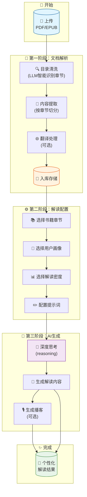
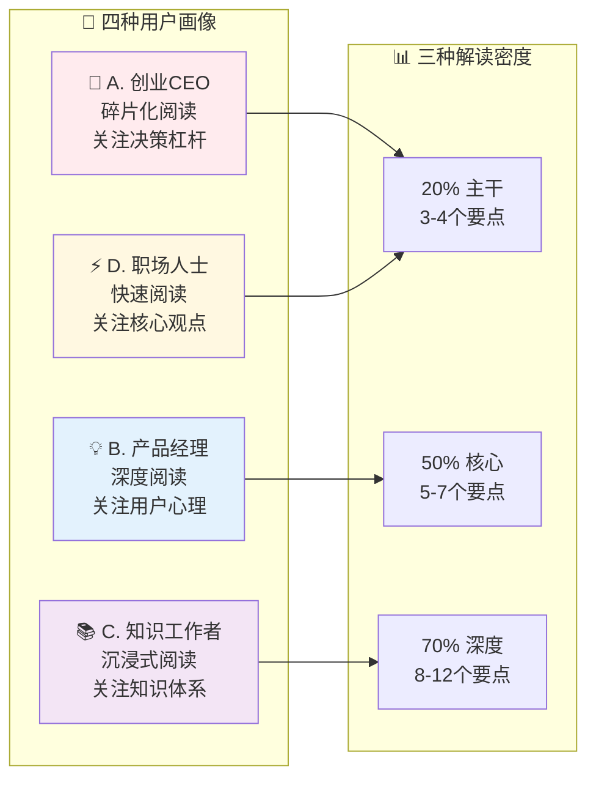
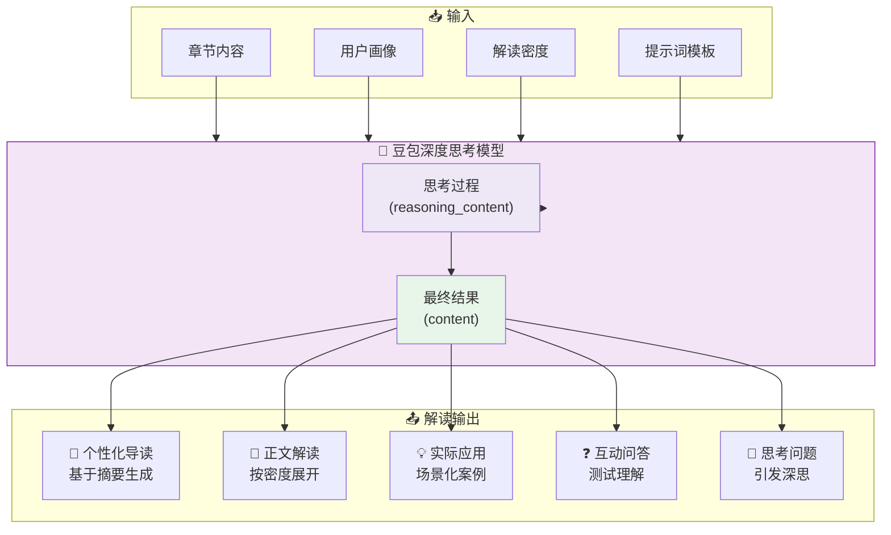
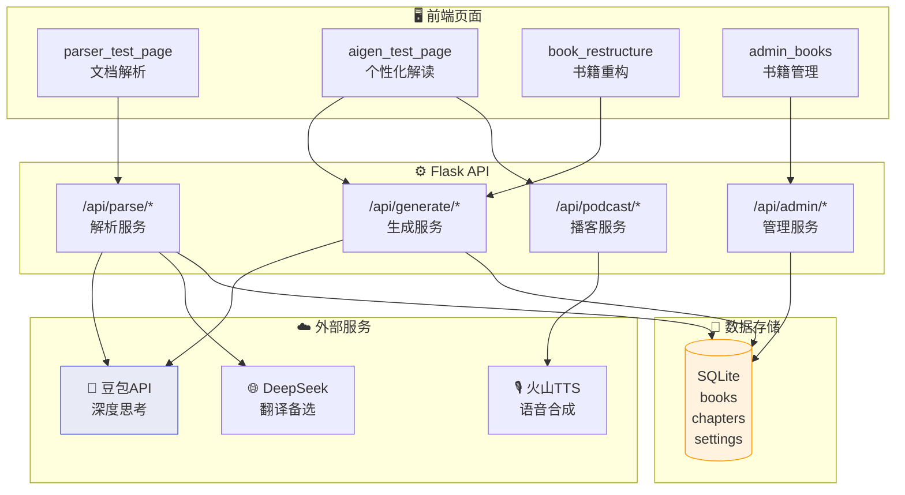
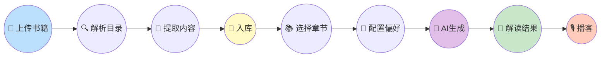

# PDF解读系统 - 业务流程图

## 🎯 核心业务流程：从上传到解读

---

## 📊 用户画像与解读密度

---

## 🔄 解读内容生成结构

---

## 🏗️ 系统架构总览

---

## 📋 简化版：一图看懂全流程

---

## 🎬 操作步骤速查

| 步骤 | 页面 | 操作 | 结果 |
|:---:|:---:|:---|:---|
| 1️⃣ | 文档解析 | 上传PDF/EPUB | 获取文件 |
| 2️⃣ | 文档解析 | 点击"目录清洗" | 识别章节结构 |
| 3️⃣ | 文档解析 | 点击"解析内容" | 提取各章内容 |
| 4️⃣ | 文档解析 | 点击"入库" | 保存到数据库 |
| 5️⃣ | 个性化解读 | 选择书籍章节 | 加载内容 |
| 6️⃣ | 个性化解读 | 选择用户画像 | 定制风格 |
| 7️⃣ | 个性化解读 | 选择解读密度 | 控制详略 |
| 8️⃣ | 个性化解读 | 点击"生成解读" | AI生成内容 |
| 9️⃣ | 个性化解读 | 点击"生成播客" | 语音输出 |
